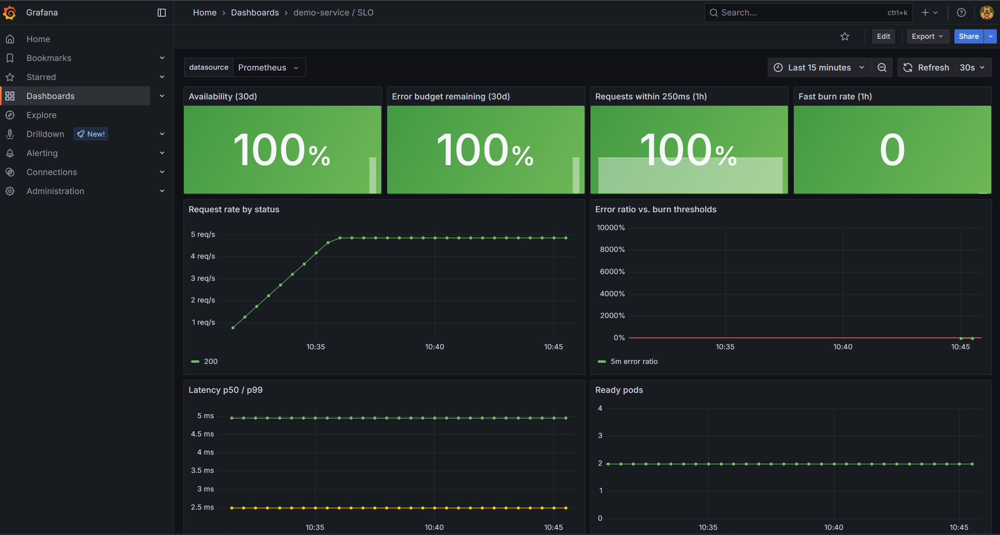
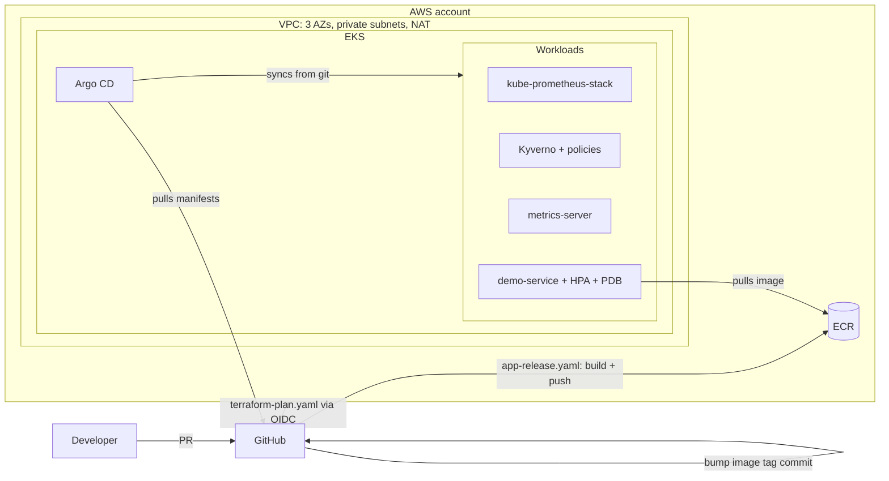

# eks-platform-showcase

A production-shaped Kubernetes platform on AWS, built the way I would build it for a client:
infrastructure in Terraform, everything in the cluster reconciled from git by Argo CD,
SLO-based alerting instead of CPU alerts, and policy guardrails enforced at admission.

It runs two ways from the same manifests:

| Mode | Command | Cost | Use it for |
|---|---|---|---|
| **Local** (kind) | `make local-up` | free | trying it in 10 minutes |
| **AWS** (EKS) | `make bootstrap && make apply` | roughly $4–5/day, see [Cost](#cost) | the real thing |



*The `demo-service / SLO` Grafana dashboard on the local kind cluster, under synthetic load.*

## What this demonstrates

| Area | Implementation | Why it matters to a client |
|---|---|---|
| Infrastructure as Code | Terraform modules (`network`, `eks-cluster`, `ecr`), S3 state with native locking | Reproducible environments, reviewable changes |
| Cluster | EKS 1.33, managed node group on Spot, Access Entries (no `aws-auth`), Pod Identity, IMDSv2 hop limit 1 | Current AWS best practice, not 2021 tutorials |
| GitOps | Argo CD app-of-apps with sync waves, self-heal, prune | Cluster state equals git; drift is corrected automatically |
| CI/CD | GitHub Actions with OIDC to AWS (no static keys), plan posted on PRs, gated apply, image tag bump via commit | Auditable, keyless pipelines |
| Observability | kube-prometheus-stack, app metrics, Grafana SLO dashboard | Answers "is the service OK for users?" |
| SRE practice | Availability and latency SLOs, multi-window multi-burn-rate alerts, runbooks, game-day postmortem | Pages only when users are affected, with a runbook attached |
| Security | Kyverno policies (non-root, no privileged, resources, no `:latest`), distroless non-root image, NetworkPolicies, checkov in CI | Guardrails enforced, not just documented |
| Maintenance | Renovate for charts, modules, providers and pinned action digests | The repo does not rot |

## Architecture



**The boundary between Terraform and GitOps** is deliberate: Terraform owns AWS resources only.
A single idempotent script (`scripts/bootstrap-argocd.sh`) installs Argo CD and the root app, and
Argo CD owns everything inside the cluster. CI never needs network access to the Kubernetes API.
Reasoning in [ADR 0002](docs/adr/0002-terraform-vs-gitops-boundary.md).

## Repository layout

```
apps/demo-service/          Go service (stdlib only): /api/hello, /metrics, probes, fault injection
  deploy/base               Deployment, Service, HPA, PDB, NetworkPolicy, ServiceMonitor
  deploy/overlays/{dev,local}
infra/terraform/
  bootstrap/                state bucket + GitHub OIDC roles (applied once, by hand)
  modules/                  network, eks-cluster, ecr
  environments/dev/         composes the modules
gitops/
  bootstrap/                Argo CD values + root Applications
  clusters/{dev,local}/     one Application per platform component (app-of-apps)
  platform/policies/        Kyverno ClusterPolicies
  platform/observability/   SLO PrometheusRule + Grafana dashboard
docs/                       getting started, SLOs, ADRs, runbooks, postmortem
```

## Quick start (local, free)

Requirements: Docker, kind, kubectl, helm. Argo CD pulls manifests from this public repo.
If you fork it, run `make set-repo` first, then commit and push, so Argo CD syncs from your fork.

```bash
make local-up          # kind cluster + image + Argo CD + root app
kubectl -n argocd get applications -w   # wait until everything is Synced/Healthy
make load              # synthetic traffic
make grafana           # dashboard "demo-service / SLO"
```

Full walkthrough, including AWS: [docs/getting-started.md](docs/getting-started.md).

## Run an incident drill

The service has a fault-injection knob. Change it **through git**, since Argo CD's self-heal would revert a `kubectl edit`:

```yaml
# apps/demo-service/deploy/base/deployment.yaml
- name: FAULT_ERROR_RATE
  value: "0.2"
```

Push it, and within a few minutes `DemoServiceErrorBudgetBurnFast` fires in Alertmanager (`make prometheus` → Alerts).
Revert the commit to recover. [docs/postmortems/2026-10-game-day-001.md](docs/postmortems/2026-10-game-day-001.md)
is the write-up of exactly this exercise.

## Cost

Approximate on-demand figures for `eu-central-1`. Check current AWS pricing before relying on them.

| Item | Approx. |
|---|---|
| EKS control plane | $0.10/hour |
| NAT gateway (single) | about $0.05/hour + data processing |
| 2 × t3.large Spot nodes | about $0.03–0.04/hour each |
| EBS (20 GiB gp3) + CloudWatch logs | a few dollars/month |

That is roughly **$4–5 per day**. Run `make destroy` when you are done; nothing here is meant to run 24/7.

## Deliberate simplifications

Being explicit about what a client engagement would add:

- **Single NAT gateway and Spot-only nodes.** Prod would use one NAT per AZ and an on-demand baseline.
- **No ingress or public DNS.** UIs are reached with `kubectl port-forward`. Prod would use the AWS Load Balancer Controller, ExternalDNS and cert-manager.
- **Alertmanager has no receivers configured.** Prod would route `severity=page` to PagerDuty/Opsgenie and `ticket` to Slack or Jira.
- **The apply role is AdministratorAccess.** Prod would scope it with a permission boundary ([ADR 0004](docs/adr/0004-ci-credentials.md)).
- **No logs or traces stack yet.** Loki and Tempo are the next steps.

## Decisions

- [0001 Use EKS managed node groups, not Karpenter (yet)](docs/adr/0001-node-provisioning.md)
- [0002 Terraform stops at the cluster; Argo CD owns the inside](docs/adr/0002-terraform-vs-gitops-boundary.md)
- [0003 SLO-based alerting](docs/adr/0003-slo-based-alerting.md)
- [0004 CI credentials via GitHub OIDC](docs/adr/0004-ci-credentials.md)

## License

MIT
