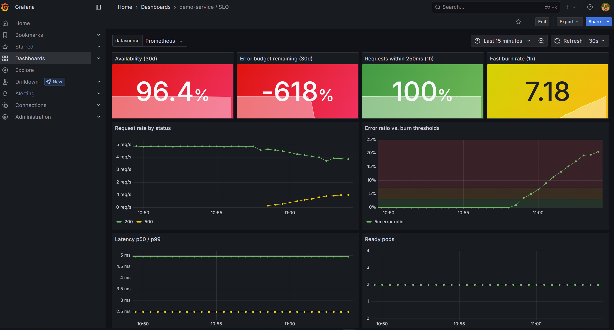
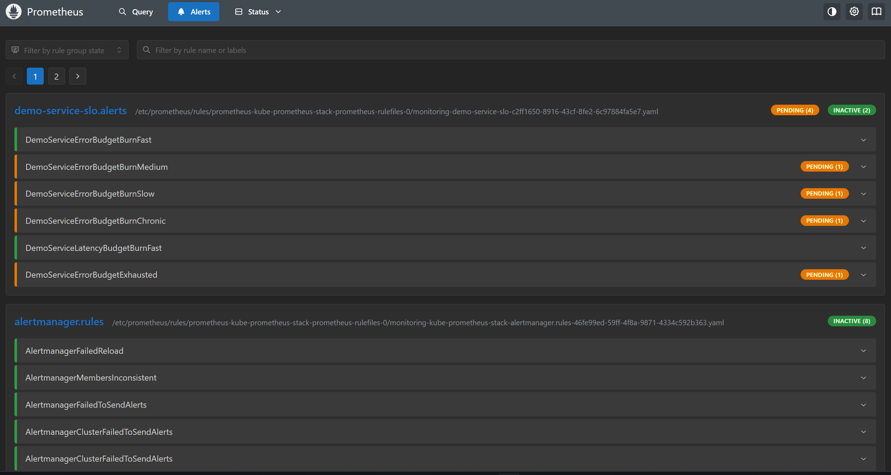
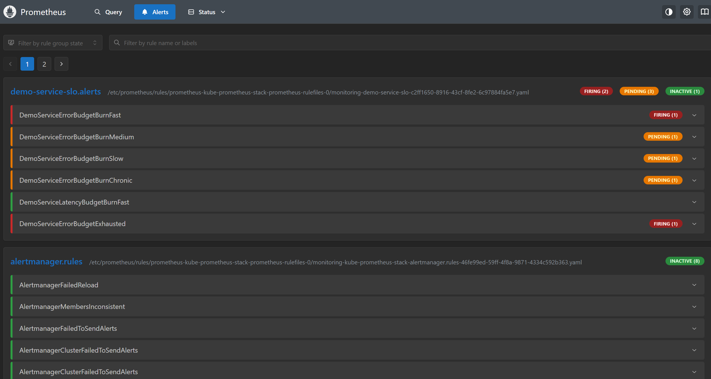
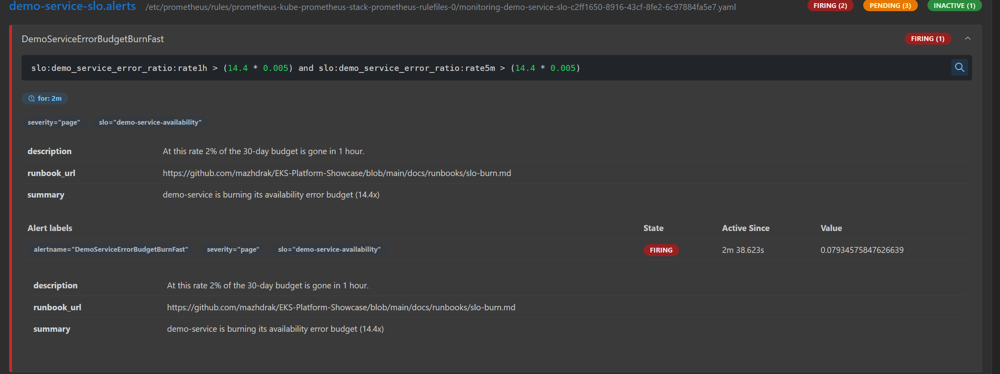
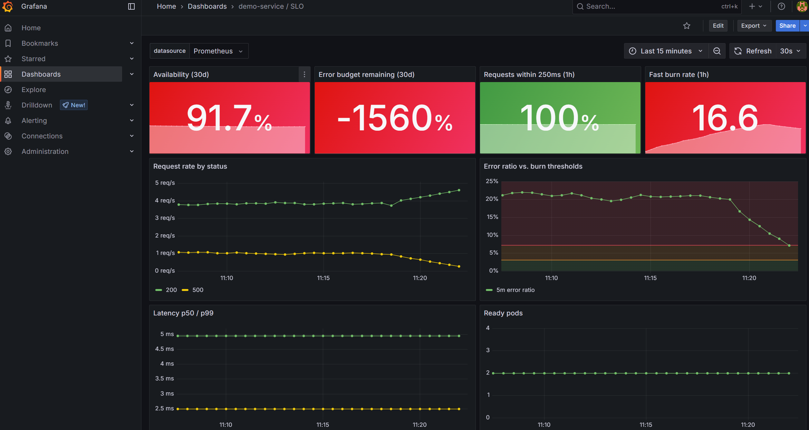
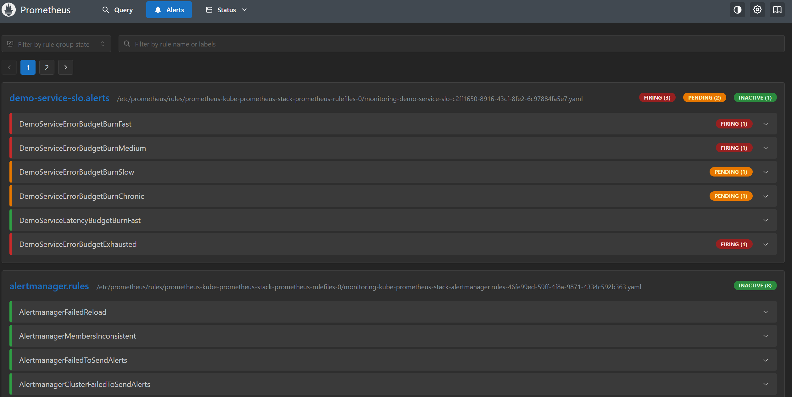
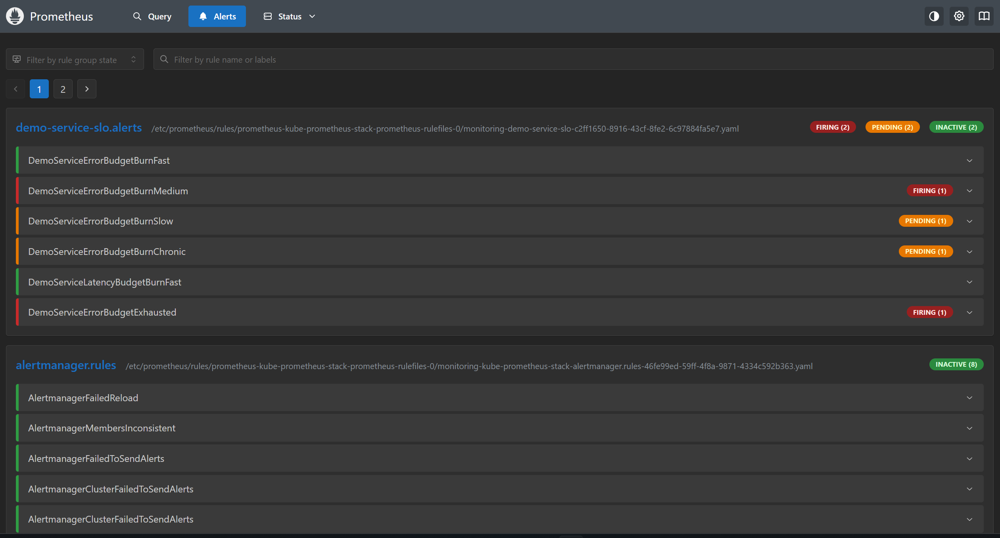

# Postmortem: Game day 001, injected 20% error rate

- **Date:** 2026-10-07
- **Type:** planned fault injection (game day), not a customer-facing incident
- **Environment:** local kind cluster (`make local-up`), synthetic load from `make load`
- **Duration of fault:** ~18 min (errors live 11:01:40 → ~11:19:30, EEST)
- **Severity reached:** page (`DemoServiceErrorBudgetBurnFast`, `DemoServiceErrorBudgetBurnMedium`)
- **Status:** reviewed

## Summary

A commit set `FAULT_ERROR_RATE=0.2` on demo-service, so 20% of `/api/hello` requests returned
HTTP 500. Argo CD rolled the change out with zero downtime, the SLO dashboard showed the
error ratio crossing both burn thresholds within a minute, and the fast-burn page fired
~15 minutes after errors began. Reverting the commit restored service. The fast-burn alert
cleared ~4 minutes after recovery.

The drill confirmed that the detection and mitigation path works end to end. It also
disproved two of our own predictions and exposed four platform issues, listed under
[Findings](#findings).

## Hypothesis

> If 20% of requests fail, `DemoServiceErrorBudgetBurnFast` fires within about 5 minutes.

**Result: rejected.** It took ~15 minutes from the first error to firing. See finding 1.

## Impact

| Metric | Value |
|---|---|
| Failed requests | ~1 req/s for ~18 min, about 1,050 requests |
| Error budget consumed (over a real 30-day window) | ~1.7% (3.6 of 216 allowed error-minutes) |
| Latency | unaffected (p99 < 5 ms) |
| Availability of pods | unaffected (2/2 ready throughout, including both rollouts) |

The dashboard showed availability 91.7% and error budget −1560%. Those numbers are a
local-mode artifact (finding 4), not the real impact.

## Timeline (EEST, UTC+3)

| Time | T+ | Event |
|---|---|---|
| 10:32 | | Synthetic load starts, ~4.9 req/s, 0% errors |
| 10:55:22 | 0:00 | Fault commit `246ad2c` pushed |
| ~11:01:40 | 6:20 | Argo CD syncs; rolling update replaces both pods, no downtime |
| ~11:02 | 6:40 | 5m error ratio crosses 7.2% (fast-burn threshold) |
| ~11:06 | 10:40 | `BurnMedium` → pending |
| 11:09 | 13:40 | Unrelated monitoring fix pushed mid-drill (`6eaba9f`, see finding 5) |
| 11:10:32 | 15:10 | Grafana pod restarts; responder's port-forward drops |
| ~11:14:30 | 19:10 | `BurnFast` → pending (1h error ratio 7.9%) |
| ~11:16 | ~21:00 | **`BurnFast` → firing.** First page (pending + `for: 2m`) |
| 11:16:23 | 21:01 | Revert `890826c` pushed within a minute of the page (mitigation) |
| ~11:19:30 | 24:10 | Argo CD syncs revert; 500s start falling |
| ~11:21 | 25:40 | `BurnMedium` → firing (its 30m window still contains the errors) |
| ~11:23 | 27:40 | **`BurnFast` resolves** as the 5m window drops below 7.2% |
| ~11:50 (expected) | | `BurnMedium` resolves once errors leave its 30m window |

Key intervals:

| Interval | Duration |
|---|---|
| Push → errors live (GitOps latency) | 6m 20s |
| Errors live → first page | ~15 min |
| Revert pushed → errors stop | ~3 min |
| Errors stop → page clears | ~4 min |

## Evidence

**Fault live.** 500s at ~1 req/s (yellow), 5m error ratio past both thresholds. Latency and
pods unaffected: an application-level failure, not an infrastructure one.



**Medium pending, Fast not yet.** The 30m window crossed 3% before the 1h window crossed 7.2%.



**First page.** `BurnFast` firing with a 1h error ratio of 7.9%. The runbook link is attached
to the alert.





**Recovery.** After the revert, 500s drop and the 5m error ratio falls through the red line.
The 1h burn rate (16.6) decays slowly, which is why the alert needs both windows.





**Fast burn resolved** ~4 minutes after errors stopped. `BurnMedium` and `BudgetExhausted`
are still firing (findings 3 and 4).



## Findings

### 1. Our detection-time estimate was wrong

We predicted ~5 minutes. The correct mental model for a multi-window alert is:

```
time to fire ≈ (threshold burn rate / actual burn rate) × long window + for:
             = (14.4 / 40) × 60 min + 2 min ≈ 24 min   (with a full clean hour of history)
```

At 20% errors (40× burn) the fast-burn page is *designed* to take over 20 minutes. It is
calibrated for catastrophes: at 100% errors (200× burn) the same rule fires in ~6 minutes.
The full table is in [docs/slo.md](../slo.md#how-long-until-an-alert-fires).

`BurnMedium` went pending before `BurnFast` here only because its 6h window held ~30 minutes
of history. With full history `BurnFast` pages first (~24 min vs ~69 min at 20% errors).

We measured ~15 minutes rather than ~24, because the 1h window held only ~30 minutes of clean
traffic (load started at 10:32). **Open question:** the measured 1h ratio (7.9% at 11:14:30)
is about 30% higher than our back-of-envelope estimate (~6%). Not yet explained. Verify with
`sum by (code) (increase(http_requests_total[1h]))` in game day 002.

### 2. GitOps sync latency dominates time-to-mitigate

6m 20s from push to rollout for the fault, and ~3 min for the revert. Argo CD polls git
every 120 s, plus queueing. In a real incident the responder waits on this after deciding to
revert.

### 3. A page fired after mitigation

`BurnMedium` (severity `page`) went to firing at ~11:21, five minutes *after* the revert was
pushed, because its 30m window still contained the errors. A responder would be paged for an
incident they had already fixed.

### 4. 30-day panels and `BudgetExhausted` are misleading with short history

Local Prometheus had ~50 minutes of data, so every "30d" query was really a 50-minute query.
The dashboard reported −1560% budget and `BudgetExhausted` fired. With 30 real days of data the
same incident consumes ~1.7% of the budget. The same applies to a freshly deployed production
service.

### 5. We changed the monitoring stack during the incident

A fix for a false `KubeProxyDown` alert (finding 6) was pushed mid-drill. It restarted Grafana,
dropped the responder's dashboard, and led us to wrongly suspect a Prometheus restart: we spent
time checking that before ruling it out (Prometheus uptime was 53 min). Changes to the
observability stack during an incident cost visibility exactly when it is needed.

### 6. `KubeProxyDown` fires permanently on kind

kind binds kube-proxy metrics to `127.0.0.1`, so the target is unreachable. Noise like this
trains people to ignore alerts. Fixed in `6eaba9f` by not scraping kube-proxy in local mode.

## What went well

- Rolling updates were zero-downtime in both directions (`maxUnavailable: 0`, readiness
  drain before shutdown).
- The 5m error ratio showed the problem within a minute of the rollout.
- The alert carried a working `runbook_url`, and runbook step 2 ("did something change?")
  pointed straight at the fault commit.
- Mitigation was a `git revert`: auditable, and nothing to remember to undo.
- The fast-burn page cleared ~4 minutes after recovery instead of lingering for an hour.

## Not tested

- The self-heal check (`kubectl set env` should be reverted by Argo CD) was skipped. Run it in
  game day 002.

## Action items

| # | Action | Type | Status |
|---|---|---|---|
| 1 | Document the time-to-fire formula next to the alert table in `docs/slo.md` | detect | **done** |
| 2 | Configure a GitHub → Argo CD webhook to remove polling latency | mitigate | open |
| 3 | Route `BurnMedium` / `BurnFast` through Alertmanager with an inhibit rule or grouping so a page for an already-mitigated incident is suppressed or merged | detect | open |
| 4 | Guard 30d panels and `BudgetExhausted` with a data-coverage condition (e.g. require ≥ 7d of samples), or show coverage on the dashboard | detect | open |
| 5 | Adopt a change freeze on `monitoring` and `argocd` apps while an incident is open | process | open |
| 6 | Stop scraping kube-proxy on kind | detect | **done** (`6eaba9f`) |
| 7 | Game day 002: 100% error rate for 10 min, plus the self-heal check and the open question from finding 1 | verify | open |

*Blameless: this document describes systems and decisions, not people.*
